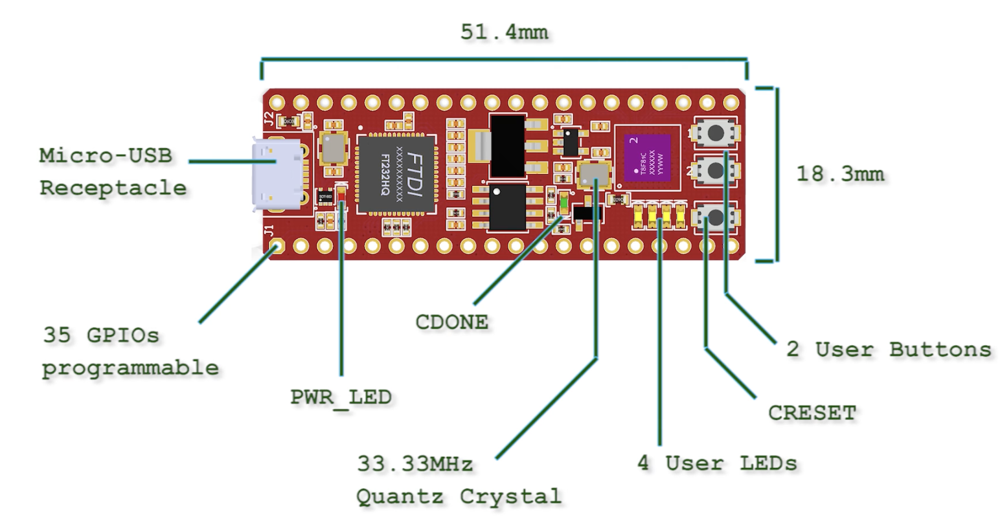

<a name="readme-top"></a>

<!-- PROJECT LOGO -->
<div align="center">
  <h3 align="center">FPGA-Based LED Brightness Control</h3>
  <p align="center">
    Research Internship Co-op Project involving PWM and PFM approaches for controlling LED brightness using an Effinity FPGA.
  </p>
</div>

<!-- TABLE OF CONTENTS -->
<details>
  <summary>Table of Contents</summary>
  <ol>
    <li><a href="#project-overview">Project Overview</a></li>
    <li><a href="#fpga-vs-cpu">FPGA vs CPU</a></li>
    <li><a href="#implementation">Implementation</a></li>
    <li><a href="#technologies-used">Technologies Used</a></li>
    <li><a href="#code-sample">Code Sample</a></li>
    <li><a href="#acknowledgements">Acknowledgements</a></li>
    <li><a href="#contact">Contact</a></li>
  </ol>
</details>

<!-- PROJECT OVERVIEW -->
## Project Overview
<a name="project-overview"></a>

During my research internship co-op, I worked on a project using an Effinity-based FPGA to control the brightness of an array of LEDs. The project involved implementing two different methods to modulate LED brightness: Pulse Width Modulation (PWM) and Pulse Frequency Modulation (PFM). I focused on using the PWM approach to control the LEDs' brightness levels.


<p align="right">(<a href="#readme-top">back to top</a>)</p>

<!-- FPGA vs CPU -->
## FPGA vs CPU
<a name="fpga-vs-cpu"></a>

### How an FPGA Works
Field Programmable Gate Arrays (FPGAs) are integrated circuits that can be configured by the user after manufacturing. Unlike a CPU, which executes instructions sequentially based on a pre-defined architecture, an FPGA allows for highly parallel computation. FPGAs are reprogrammable, meaning that you can design custom hardware architectures tailored to specific tasks. The logic gates and interconnects inside the FPGA can be rewired to perform different tasks, enabling custom implementations of digital circuits.

### FPGA vs CPU:
- **Parallelism**: An FPGA is capable of true hardware-level parallelism. Multiple logic operations can occur simultaneously. On the other hand, a CPU typically performs tasks sequentially, even with multi-core architectures.
- **Flexibility**: CPUs have a fixed architecture designed for general-purpose computing, while FPGAs can be tailored for specific tasks, making them highly efficient for specialized applications like signal processing, custom controllers, etc.
- **Latency**: FPGAs offer lower latency because computations can be done in hardware, whereas CPUs often require instructions to be fetched and decoded before being executed.

<p align="right">(<a href="#readme-top">back to top</a>)</p>

<!-- IMPLEMENTATION -->
## Implementation
<a name="implementation"></a>

The core of the project was controlling the brightness of an LED array using Pulse Width Modulation (PWM). PWM works by varying the duty cycle of a signal — essentially how long the signal stays high vs. low during each cycle. By adjusting this, the LEDs' brightness can be modulated. A higher duty cycle results in brighter LEDs, while a lower duty cycle dims them.

The FPGA allows us to create a hardware module to generate PWM signals efficiently. My implementation used the FPGA to control multiple PWM signals for the LED array, ensuring smooth and accurate brightness control.

<p align="right">(<a href="#readme-top">back to top</a>)</p>

<!-- TECHNOLOGIES USED -->
## Technologies Used
<a name="technologies-used"></a>

* [![Xilinx Vivado][Xilinx-Vivado-shield]][Xilinx-Vivado-url]
* [![Effinity FPGA][Effinity-shield]][Effinity-url]
* [![PWM][PWM-shield]][PWM-url]

<p align="right">(<a href="#readme-top">back to top</a>)</p>

<!-- CODE SAMPLE -->
## Code Sample
<a name="code-sample"></a>

```verilog
module pwm_controller (
  input clk,         // System clock
  input [7:0] duty,  // Duty cycle input (0-255)
  output reg pwm_out // PWM output signal
);
  reg [7:0] counter;

  always @(posedge clk) begin
    if (counter < duty) begin
      pwm_out <= 1;
    end else begin
      pwm_out <= 0;
    end
    counter <= counter + 1;
  end
endmodule
```
This Verilog code implements a simple PWM controller that modulates an LED's brightness based on the input duty cycle. The counter compares its value to the duty cycle to determine when to turn the LED on or off.

<p align="right">(<a href="#readme-top">back to top</a>)</p>
<!-- ACKNOWLEDGEMENTS -->
Acknowledgements
<a name="acknowledgements"></a>

I would like to thank my team members and mentor, Boyun Wang, and Open Avenues for this Micro Internship opportunity and for their guidance and support throughout this project.

<p align="right">(<a href="#readme-top">back to top</a>)</p> <!-- CONTACT -->
Contact
<a name="contact"></a>

For any questions, feel free to reach out to me via email at sal.hndrx@gmail.com.

<p align="right">(<a href="#readme-top">back to top</a>)</p> 
<!-- MARKDOWN LINKS & IMAGES -->

[Xilinx-Vivado-shield]: https://img.shields.io/badge/Xilinx_Vivado-F75C03?style=for-the-badge&logo=xilinx&logoColor=white
[Xilinx-Vivado-url]: https://www.xilinx.com/products/design-tools/vivado.html


[VHDL-shield]: https://img.shields.io/badge/VHDL-4B0082?style=for-the-badge
[VHDL-url]: https://en.wikipedia.org/wiki/VHDL

[Effinity-shield]: https://img.shields.io/badge/effinity-FPGA-green?style=for-the-badge
[Effinity-url]: https://www.effinity.com/

[PWM-shield]: https://img.shields.io/badge/PWM-FFA500?style=for-the-badge
[PWM-url]: https://en.wikipedia.org/wiki/Pulse-width_modulation


